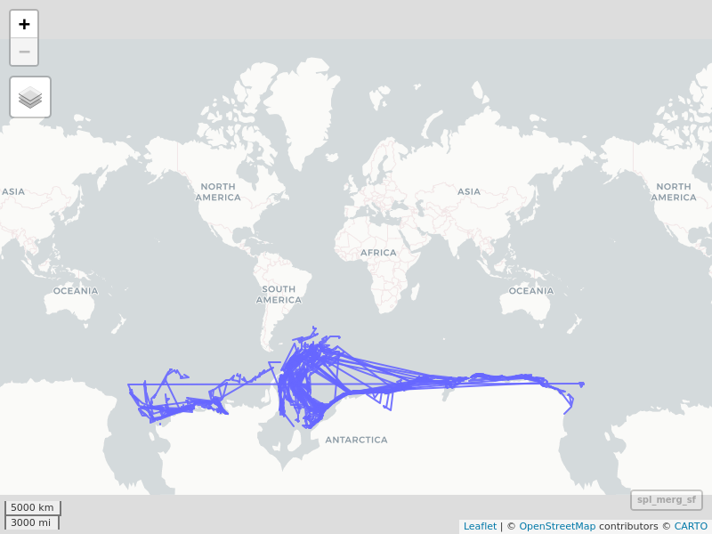
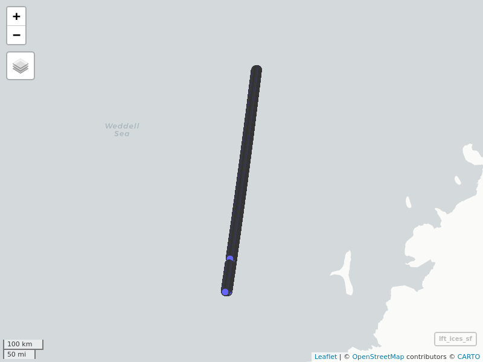

R programming analysis for the ‘Berg’ project
================
Lampros Sp. Mouselimis
2022-04-02

<br>

This is the [R Markdown](http://rmarkdown.rstudio.com) Notebook that
explains a part of my solution (using R programming) for the “Berg”
ICESat-2 Hackweek 2022 project.

``` r
# parameters

init_crs = 4326
pth_icebrg_arch = 'AntarcIcebergs_archive.txt'


# required R packages

require(magrittr)
require(plotly)
require(mapview)
require(sf)
require(glue)
require(units)
require(data.table)
require(IceSat2R)
```

<br>

Load the ‘AntarcIcebergs\_archive.txt’ file with the (currently) 377
iceberg records

``` r
dat_iceb = data.table::fread(file = pth_icebrg_arch, 
                             sep = ' ',
                             stringsAsFactors = F, 
                             header = TRUE)
dat_iceb
```

    ##                            csv_file       date
    ##   1: AntarcticIcebergs_20220318.csv 03-18-2022
    ##   2: AntarcticIcebergs_20220311.csv 03-11-2022
    ##   3: AntarcticIcebergs_20220304.csv 03-04-2022
    ##   4: AntarcticIcebergs_20220225.csv 02-25-2022
    ##   5: AntarcticIcebergs_20220218.csv 02-18-2022
    ##  ---                                          
    ## 373: AntarcticIcebergs_20141219.csv 12-19-2014
    ## 374: AntarcticIcebergs_20141211.csv 12-11-2014
    ## 375: AntarcticIcebergs_20141205.csv 12-05-2014
    ## 376: AntarcticIcebergs_20141121.csv 11-21-2014
    ## 377: AntarcticIcebergs_20141107.csv 11-07-2014

<br>

Iterate over the 377 files to load all past icebergs in Antarctica

``` r
all_iceb = all_iceb_error = list()

for (x in 1:nrow(dat_iceb)) {
  # cat(paste0(x, '.'))
  csv_file_iter = dat_iceb$csv_file[x]
  csv_file_iter = gsub('.csv', '', csv_file_iter)
  date_code = strsplit(csv_file_iter, '_')[[1]][2]
  year = substr(date_code, 1, 4)
  code = substr(date_code, 5, nchar(date_code))
  url_code = glue::glue("https://usicecenter.gov/File/DownloadArchive?prd=134{code}{year}")
  iter_iceb = tryCatch(data.table::fread(url_code, verbose = F, showProgress = F), error = function(e) e)
  if (!inherits(iter_iceb, 'error')) {
    all_iceb[[as.character(x)]] = iter_iceb 
  }
  else {
    all_iceb_error[[as.character(x)]] = iter_iceb$message
  }
}

archive_iceb = data.table::rbindlist(all_iceb)
archive_iceb
```

    ##        Iceberg Length (NM) Width (NM) Latitude Longitude        Remarks
    ##     1:    A23A          40         34   -75.26    -37.32          belle
    ##     2:     A64           9          8   -67.01    -60.00          belle
    ##     3:    A69A          10          9   -66.30    -58.95          belle
    ##     4:    A69B          10          5   -65.97    -58.56          belle
    ##     5:    A69C          10          3   -66.63    -58.91          belle
    ##    ---                                                                 
    ## 17105:    D20A          27          9   -69.15     36.65 amerw (fasted)
    ## 17106:    D20B          11          2   -69.02     36.27 amerw (fasted)
    ## 17107:    D21A          21          5   -67.02     67.78          amere
    ## 17108:    D21B          11          4   -66.08     85.30 amere (fasted)
    ## 17109:     D22          12          3   -65.97     86.92 amere (fasted)
    ##        Last Update
    ##     1:   3/18/2022
    ##     2:   3/18/2022
    ##     3:   3/18/2022
    ##     4:   3/18/2022
    ##     5:   3/18/2022
    ##    ---            
    ## 17105:   11/7/2014
    ## 17106:   11/7/2014
    ## 17107:   11/7/2014
    ## 17108:   11/7/2014
    ## 17109:   11/7/2014

<br>

Modify the dates format

``` r
archive_iceb$`Last Update` = gsub('/', '-', archive_iceb$`Last Update`)
```

<br>

Add leading zeros (months, days) and convert to valid date format

``` r
proc_date = strsplit(archive_iceb$`Last Update`, '-')
proc_date = lapply(proc_date, function(x) {
  x = ifelse(nchar(x) == 1, glue::glue("0{x}"), x)
  paste(x, collapse = '-')
})

proc_date = as.vector(unlist(proc_date))
archive_iceb$`Last Update` = proc_date

archive_iceb$`Last Update` = lubridate::mdy(archive_iceb$`Last Update`)
archive_iceb
```

    ##        Iceberg Length (NM) Width (NM) Latitude Longitude        Remarks
    ##     1:    A23A          40         34   -75.26    -37.32          belle
    ##     2:     A64           9          8   -67.01    -60.00          belle
    ##     3:    A69A          10          9   -66.30    -58.95          belle
    ##     4:    A69B          10          5   -65.97    -58.56          belle
    ##     5:    A69C          10          3   -66.63    -58.91          belle
    ##    ---                                                                 
    ## 17105:    D20A          27          9   -69.15     36.65 amerw (fasted)
    ## 17106:    D20B          11          2   -69.02     36.27 amerw (fasted)
    ## 17107:    D21A          21          5   -67.02     67.78          amere
    ## 17108:    D21B          11          4   -66.08     85.30 amere (fasted)
    ## 17109:     D22          12          3   -65.97     86.92 amere (fasted)
    ##        Last Update
    ##     1:  2022-03-18
    ##     2:  2022-03-18
    ##     3:  2022-03-18
    ##     4:  2022-03-18
    ##     5:  2022-03-18
    ##    ---            
    ## 17105:  2014-11-07
    ## 17106:  2014-11-07
    ## 17107:  2014-11-07
    ## 17108:  2014-11-07
    ## 17109:  2014-11-07

``` r
str(archive_iceb)
```

    ## Classes 'data.table' and 'data.frame':   17109 obs. of  7 variables:
    ##  $ Iceberg    : chr  "A23A" "A64" "A69A" "A69B" ...
    ##  $ Length (NM): num  40 9 10 10 10 8 30 73 20 16 ...
    ##  $ Width (NM) : num  34 8 9 5 3 5 18 14 7 7 ...
    ##  $ Latitude   : num  -75.3 -67 -66.3 -66 -66.6 ...
    ##  $ Longitude  : num  -37.3 -60 -59 -58.6 -58.9 ...
    ##  $ Remarks    : chr  "belle" "belle" "belle" "belle" ...
    ##  $ Last Update: Date, format: "2022-03-18" "2022-03-18" ...
    ##  - attr(*, ".internal.selfref")=<externalptr>

<br>

remove potential NA’s and keep complete cases (from 17109 observations
25 have NA’s and will be removed)

``` r
comp_cases = complete.cases(archive_iceb)
archive_iceb = archive_iceb[comp_cases, , drop = F]
```

<br>

split by iceberg name

``` r
spl_iceb = split(archive_iceb, by = 'Iceberg')
```

<br>

exclude icebergs with a single observation (that can not form a natural
trajectory)

``` r
idx_valid = which(as.vector(unlist(lapply(spl_iceb, nrow))) > 1)
```

<br>

keep valid icebergs (from the initial 132 unique icebergs 121 will be
used in this analysis)

``` r
spl_iceb_valid = spl_iceb[idx_valid]
length(spl_iceb_valid)
```

    ## [1] 121

<br>

sort each sublist (unique iceberg) by date

``` r
spl_iceb_valid = lapply(spl_iceb_valid, function(x) {
  x = x[order(x$`Last Update`, decreasing = T)]
  x
})
```

<br>

create linestrings and add distance (this might not be correct in a few
cases due to the anti-meridian crossing)

``` r
spl_iceb_valid_linestr = list()

for (y in seq_along(spl_iceb_valid)) {
  
  # cat(paste0(y, '.'))
  x = spl_iceb_valid[[y]]
  sf_iter = tryCatch(sf::st_as_sf(x, coords = c('Longitude', 'Latitude'), crs = init_crs) %>% 
                       sf::st_union() %>%
                       sf::st_cast("LINESTRING") %>%
                       sf::st_as_sf(crs = init_crs), error = function(e) e)
  
  if (!inherits(sf_iter, 'error')) {
    
    sf_iter$Iceberg = unique(x$Iceberg)
    sf_iter$Min_Length = min(x$`Length (NM)`)
    sf_iter$Max_Length = max(x$`Length (NM)`)
    sf_iter$Min_Width = min(x$`Width (NM)`)
    sf_iter$Max_Width = max(x$`Width (NM)`)
    sf_iter$start_date = min(x$`Last Update`)
    sf_iter$end_date = max(x$`Last Update`)
    sf_iter$total_N_days = length(seq(from = as.Date(sf_iter$start_date), to = as.Date(sf_iter$end_date), by = '1 day'))
    sf_iter$distance_km = as.numeric(units::set_units(sf::st_length(sf_iter), km))
    spl_iceb_valid_linestr[[as.character(y)]] = sf_iter 
  }
  else {
    print(sf_iter$message)
  }
}
```

<br>

rbind the summarized results and order by the lengt of the linestring
(‘distance\_km’ column)

``` r
spl_merg = data.table::rbindlist(spl_iceb_valid_linestr)
spl_merg_sf = sf::st_as_sf(spl_merg, crs = init_crs)
spl_merg_sf = spl_merg_sf[order(spl_merg_sf$distance_km, decreasing = T), ]
spl_merg_sf
```

    ## Simple feature collection with 121 features and 9 fields
    ## Geometry type: LINESTRING
    ## Dimension:     XY
    ## Bounding box:  xmin: -179.98 ymin: -77.66 xmax: 179.75 ymax: -42.57
    ## CRS:           EPSG:4326
    ## First 10 features:
    ##    Iceberg Min_Length Max_Length Min_Width Max_Width start_date   end_date
    ## 16    B09I         12         12         6         6 2015-10-30 2022-03-18
    ## 83     B16          6         16         2         6 2014-11-07 2020-02-28
    ## 22     B39          8          8         4         4 2016-01-01 2022-03-18
    ## 91    B15T         18         28         5         7 2014-11-07 2019-03-29
    ## 58    D21B          9         11         4         4 2014-11-07 2021-04-30
    ## 99    D21A          7         21         3         5 2014-11-07 2018-02-09
    ## 95    C28B          6         21         4        14 2014-11-07 2018-08-03
    ## 82   B15AA         11         11         6         6 2014-11-07 2020-03-13
    ## 98    B09D          7         22         2         6 2014-11-07 2018-04-13
    ## 97    B15Z         10         20         5         8 2014-11-07 2018-06-08
    ##    total_N_days distance_km                              x
    ## 16         2332    35864.22 LINESTRING (113.7 -65.2, 11...
    ## 83         1940    26004.32 LINESTRING (0.97 -69.67, 6....
    ## 22         2269    25884.57 LINESTRING (115.81 -65.01, ...
    ## 91         1604    24243.14 LINESTRING (3.57 -69.97, 8....
    ## 58         2367    23777.84 LINESTRING (7.1 -69.74, 10....
    ## 99         1191    22966.58 LINESTRING (4.6 -70.08, 4.8...
    ## 95         1366    21167.77 LINESTRING (3.63 -69.9, 7.4...
    ## 82         1954    20223.80 LINESTRING (3.75 -69.98, 7....
    ## 98         1254    17543.84 LINESTRING (2.8 -69.92, 0.2...
    ## 97         1310    16978.31 LINESTRING (1.85 -69.72, 5....

<br>

visualize the linestrings

``` r
mapview::mapviewOptions(leafletWidth = 800, 
                        leafletHeight = 600)

mp = mapview::mapview(spl_merg_sf, legend = F)
mp
```

<!-- -->

<br>

Modified end output data.table of the input Icebergs data

``` r
spl_merg_dtbl = data.table::as.data.table(spl_merg_sf)
spl_merg_dtbl$x = NULL

geoms = sf::st_as_text(sf::st_geometry(spl_merg_sf))
spl_merg_dtbl$geometry = geoms
spl_merg_dtbl$start_date = as.character(spl_merg_dtbl$start_date)
spl_merg_dtbl$end_date = as.character(spl_merg_dtbl$end_date)
# spl_merg_dtbl
```

<br>

Restrict the analysis to a specific area in the Antarctic (using a Well
Known Text (WKT)), iceberg-ID and date range,

``` r
icbrg = "B09I"
start_track_date = '2020-06-26'
end_track_date = '2020-07-12'
sf_obj = "POLYGON ((-30.48828 -74.43237, -25.48828 -74.43237, -25.48828 -69.43237, -30.48828 -69.43237, -30.48828 -74.43237))"

sf_obj = sf::st_as_sfc(sf_obj, crs = init_crs)
```

<br>

### Usage of ICESat-2 data

Find the available IceSat-2 track-ID’s and Dates (time interval) from a
specific RGT cycle

``` r
res_rgt_many = IceSat2R::time_specific_orbits(date_from = start_track_date,
                                              date_to = end_track_date,
                                              RGT_cycle = NULL,
                                              download_method = 'curl',
                                              threads = parallel::detectCores(),
                                              verbose = FALSE)
res_rgt_many
```

    ## Simple feature collection with 24700 features and 14 fields
    ## Geometry type: POINT
    ## Dimension:     XY
    ## Bounding box:  xmin: -179.9949 ymin: -87.66456 xmax: 179.9805 ymax: 87.32871
    ## CRS:           4326
    ## First 10 features:
    ##    Name timestamp begin  end  altitudeMode tessellate extrude visibility
    ## 1            <NA>  <NA> <NA> clampToGround         -1       0          1
    ## 2            <NA>  <NA> <NA> clampToGround         -1       0          1
    ## 3            <NA>  <NA> <NA> clampToGround         -1       0          1
    ## 4            <NA>  <NA> <NA> clampToGround         -1       0          1
    ## 5            <NA>  <NA> <NA> clampToGround         -1       0          1
    ## 6            <NA>  <NA> <NA> clampToGround         -1       0          1
    ## 7            <NA>  <NA> <NA> clampToGround         -1       0          1
    ## 8            <NA>  <NA> <NA> clampToGround         -1       0          1
    ## 9            <NA>  <NA> <NA> clampToGround         -1       0          1
    ## 10           <NA>  <NA> <NA> clampToGround         -1       0          1
    ##    drawOrder icon RGT           Date_time day_of_year cycle
    ## 1         NA <NA>  10 2020-06-26 00:08:00         178     8
    ## 2         NA <NA>  10 2020-06-26 00:09:00         178     8
    ## 3         NA <NA>  10 2020-06-26 00:10:00         178     8
    ## 4         NA <NA>  10 2020-06-26 00:11:00         178     8
    ## 5         NA <NA>  10 2020-06-26 00:12:00         178     8
    ## 6         NA <NA>  10 2020-06-26 00:13:00         178     8
    ## 7         NA <NA>  10 2020-06-26 00:14:00         178     8
    ## 8         NA <NA>  10 2020-06-26 00:15:00         178     8
    ## 9         NA <NA>  10 2020-06-26 00:16:00         178     8
    ## 10        NA <NA>  10 2020-06-26 00:17:00         178     8
    ##                       geometry
    ## 1  POINT (147.3292 0.01247222)
    ## 2    POINT (146.9448 3.853247)
    ## 3    POINT (146.5593 7.694253)
    ## 4    POINT (146.1712 11.53503)
    ## 5    POINT (145.7794 15.37512)
    ## 6     POINT (145.3823 19.2141)
    ## 7    POINT (144.9477 23.04982)
    ## 8     POINT (144.533 26.88535)
    ## 9    POINT (144.1086 30.71875)
    ## 10    POINT (143.6699 34.5496)

<br>

Create the bounding of the selected area and proceed to the intersection
with the computed RGT’s ( include the bounding box for reproducibility )

``` r
bbx_aoi = sf::st_bbox(obj = sf_obj)
# c(xmin = 140, ymin = -6.641235, xmax = 145, ymax = -1.641235)

sf_obj_bbx = sf::st_as_sfc(bbx_aoi)

res_inters = sf::st_intersects(x = sf_obj_bbx,
                               y = sf::st_geometry(res_rgt_many),
                               sparse = TRUE)
```

<br>

Find the matched (RGT) tracks,

``` r
df_inters = data.frame(res_inters)

if (nrow(df_inters) == 0) {
  stop("There is no intersection between the specified AOI and the RGTs!")
}


rgt_subs = res_rgt_many[df_inters$col.id, , drop = FALSE]
rgt_subs
```

    ## Simple feature collection with 12 features and 14 fields
    ## Geometry type: POINT
    ## Dimension:     XY
    ## Bounding box:  xmin: -30.08691 ymin: -73.50795 xmax: -25.92126 ymax: -69.6988
    ## CRS:           4326
    ## First 10 features:
    ##       Name timestamp begin  end  altitudeMode tessellate extrude visibility
    ## 741             <NA>  <NA> <NA> clampToGround         -1       0          1
    ## 1397            <NA>  <NA> <NA> clampToGround         -1       0          1
    ## 2167            <NA>  <NA> <NA> clampToGround         -1       0          1
    ## 7192            <NA>  <NA> <NA> clampToGround         -1       0          1
    ## 7962            <NA>  <NA> <NA> clampToGround         -1       0          1
    ## 12987           <NA>  <NA> <NA> clampToGround         -1       0          1
    ## 13756           <NA>  <NA> <NA> clampToGround         -1       0          1
    ## 13757           <NA>  <NA> <NA> clampToGround         -1       0          1
    ## 18782           <NA>  <NA> <NA> clampToGround         -1       0          1
    ## 19551           <NA>  <NA> <NA> clampToGround         -1       0          1
    ##       drawOrder icon RGT           Date_time day_of_year cycle
    ## 741          NA <NA>  17 2020-06-26 12:23:02         178     8
    ## 1397         NA <NA>  24 2020-06-26 23:14:04         178     8
    ## 2167         NA <NA>  32 2020-06-27 11:58:23         179     8
    ## 7192         NA <NA>  85 2020-06-30 23:05:44         182     8
    ## 7962         NA <NA>  93 2020-07-01 11:50:03         183     8
    ## 12987        NA <NA> 146 2020-07-04 22:57:24         186     8
    ## 13756        NA <NA> 154 2020-07-05 11:40:43         187     8
    ## 13757        NA <NA> 154 2020-07-05 11:41:43         187     8
    ## 18782        NA <NA> 207 2020-07-08 22:49:05         190     8
    ## 19551        NA <NA> 215 2020-07-09 11:32:24         191     8
    ##                          geometry
    ## 741   POINT (-30.08691 -73.48359)
    ## 1397    POINT (-26.14644 -72.244)
    ## 2167  POINT (-25.96768 -69.70457)
    ## 7192   POINT (-26.9165 -72.22443)
    ## 7962  POINT (-26.73955 -69.72393)
    ## 12987 POINT (-27.68667 -72.20502)
    ## 13756 POINT (-25.92126 -73.50795)
    ## 13757 POINT (-27.51144 -69.74306)
    ## 18782  POINT (-28.4848 -72.24889)
    ## 19551 POINT (-26.72204 -73.46382)

<br>

Find out which of the time specific RGT’s match the OpenAltimetry
Track-ID’s,

``` r
tracks_dates_RGT = tracks_dates_OpenAltimetry = list()

for (item in 1:nrow(rgt_subs)) {
  
  dat_item = rgt_subs[item, , drop = F]
  Date = as.Date(dat_item$Date_time)
  
  op_tra = IceSat2R::getTracks(minx = as.numeric(bbx_aoi['xmin']),
                     miny = as.numeric(bbx_aoi['ymin']),
                     maxx = as.numeric(bbx_aoi['xmax']),
                     maxy = as.numeric(bbx_aoi['ymax']),
                     date = as.character(Date),
                     outputFormat = 'csv',
                     download_method = 'curl',
                     verbose = FALSE)
  
  date_obj = dat_item$Date_time
  tim_rgt = glue::glue("Date: {date_obj} Time specific RGT: '{dat_item$RGT}'")
  
  if (nrow(op_tra) > 0) {
    iter_op_trac = paste(op_tra$track, collapse = ', ')
    cat(glue::glue("{tim_rgt}  OpenAltimetry: '{iter_op_trac}'"), '\n')
    
    tracks_dates_RGT[[as.character(Date)]] = dat_item$RGT
    tracks_dates_OpenAltimetry[[as.character(Date)]] = op_tra$track
  }
  else {
    cat(glue::glue("{tim_rgt} without an OpenAltimetry match!"), '\n')
  }
}
```

    ## Date: 2020-06-26 12:23:02 Time specific RGT: '17'  OpenAltimetry: '17, 24' 
    ## Date: 2020-06-26 23:14:04 Time specific RGT: '24'  OpenAltimetry: '17, 24' 
    ## Date: 2020-06-27 11:58:23 Time specific RGT: '32'  OpenAltimetry: '32' 
    ## Date: 2020-06-30 23:05:44 Time specific RGT: '85'  OpenAltimetry: '78, 85' 
    ## Date: 2020-07-01 11:50:03 Time specific RGT: '93'  OpenAltimetry: '93' 
    ## Date: 2020-07-04 22:57:24 Time specific RGT: '146'  OpenAltimetry: '146' 
    ## Date: 2020-07-05 11:40:43 Time specific RGT: '154'  OpenAltimetry: '154' 
    ## Date: 2020-07-05 11:41:43 Time specific RGT: '154'  OpenAltimetry: '154' 
    ## Date: 2020-07-08 22:49:05 Time specific RGT: '207'  OpenAltimetry: '207' 
    ## Date: 2020-07-09 11:32:24 Time specific RGT: '215'  OpenAltimetry: '215' 
    ## Date: 2020-07-09 11:33:24 Time specific RGT: '215'  OpenAltimetry: '215' 
    ## Date: 2020-07-12 22:40:45 Time specific RGT: '268'  OpenAltimetry: '268'

``` r
str(tracks_dates_RGT)
```

    ## List of 9
    ##  $ 2020-06-26: int 24
    ##  $ 2020-06-27: int 32
    ##  $ 2020-06-30: int 85
    ##  $ 2020-07-01: int 93
    ##  $ 2020-07-04: int 146
    ##  $ 2020-07-05: int 154
    ##  $ 2020-07-08: int 207
    ##  $ 2020-07-09: int 215
    ##  $ 2020-07-12: int 268

``` r
str(tracks_dates_OpenAltimetry)
```

    ## List of 9
    ##  $ 2020-06-26: int [1:2] 17 24
    ##  $ 2020-06-27: int 32
    ##  $ 2020-06-30: int [1:2] 78 85
    ##  $ 2020-07-01: int 93
    ##  $ 2020-07-04: int 146
    ##  $ 2020-07-05: int 154
    ##  $ 2020-07-08: int 207
    ##  $ 2020-07-09: int 215
    ##  $ 2020-07-12: int 268

<br>

Iterate over the available, ‘Dates’, ‘trackId’, ‘products’ to gather the
up to 5-degree data (use the product ‘atl07’)

``` r
dates_iters = RGTs_iters = list()
nams_openalt = names(tracks_dates_OpenAltimetry)

count = 1
for (idx in 1:length(tracks_dates_OpenAltimetry)) {
  nam_item = nams_openalt[idx]
  item = tracks_dates_OpenAltimetry[[idx]]
  for (item_in in item) {
    print(item_in)
    RGTs_iters[[count]] = item_in
    dates_iters[[count]] = nam_item
    count = count + 1
  }
}
```

    ## [1] 17
    ## [1] 24
    ## [1] 32
    ## [1] 78
    ## [1] 85
    ## [1] 93
    ## [1] 146
    ## [1] 154
    ## [1] 207
    ## [1] 215
    ## [1] 268

``` r
dates_iters = unlist(dates_iters)
RGTs_iters = unlist(RGTs_iters)
if (length(dates_iters) != length(RGTs_iters)) stop("The size of the two vectors must match!")


prods_5_degrs = c('atl07')

dat_out = logs_out = list()

for (idx in seq_along(dates_iters)) {
  
  date_i = dates_iters[idx]
  rgt_i = RGTs_iters[idx]
  
  for (prod_i in prods_5_degrs) {
    
    name_iter = glue::glue("{date_i}_{rgt_i}_{prod_i}")
    cat(glue::glue("Date: '{date_i}'  RGT: '{rgt_i}'  Product: '{prod_i}'"), '\n')
    
    iter_dat = IceSat2R::get_atlas_data(minx = as.numeric(bbx_aoi['xmin']),
                                        miny = as.numeric(bbx_aoi['ymin']),
                                        maxx = as.numeric(bbx_aoi['xmax']),
                                        maxy = as.numeric(bbx_aoi['ymax']),
                                        date = date_i,
                                        trackId = rgt_i,
                                        product = prod_i,
                                        client = 'portal',
                                        outputFormat = 'csv',
                                        verbose = FALSE)
    
    iter_logs = list(Date = date_i,
                     RGT = rgt_i,
                     Product = prod_i,
                     N_rows = nrow(iter_dat))
    
    logs_out[[name_iter]] = data.table::setDT(iter_logs)
    dat_out[[name_iter]] = iter_dat
  }
}
```

    ## Date: '2020-06-26'  RGT: '17'  Product: 'atl07' 
    ## Date: '2020-06-26'  RGT: '24'  Product: 'atl07' 
    ## Date: '2020-06-27'  RGT: '32'  Product: 'atl07' 
    ## Date: '2020-06-30'  RGT: '78'  Product: 'atl07' 
    ## Date: '2020-06-30'  RGT: '85'  Product: 'atl07' 
    ## Date: '2020-07-01'  RGT: '93'  Product: 'atl07' 
    ## Date: '2020-07-04'  RGT: '146'  Product: 'atl07' 
    ## Date: '2020-07-05'  RGT: '154'  Product: 'atl07' 
    ## Date: '2020-07-08'  RGT: '207'  Product: 'atl07' 
    ## Date: '2020-07-09'  RGT: '215'  Product: 'atl07' 
    ## Date: '2020-07-12'  RGT: '268'  Product: 'atl07'

<br>

Logs (including the number of rows for each parameter setting)

``` r
dtbl_logs = data.table::rbindlist(logs_out)
dtbl_logs = subset(dtbl_logs, N_rows > 0)
dtbl_logs = dtbl_logs[order(dtbl_logs$N_rows, decreasing = T), ]
dtbl_logs
```

    ##           Date RGT Product N_rows
    ##  1: 2020-07-08 207   atl07 457023
    ##  2: 2020-07-09 215   atl07 446217
    ##  3: 2020-07-04 146   atl07 333653
    ##  4: 2020-06-30  85   atl07 162526
    ##  5: 2020-06-26  24   atl07 160633
    ##  6: 2020-07-01  93   atl07 156051
    ##  7: 2020-06-26  17   atl07  40330
    ##  8: 2020-06-27  32   atl07  38069
    ##  9: 2020-07-05 154   atl07   4926
    ## 10: 2020-06-30  78   atl07     71

<br>

Intersection of the icesat-2 with the AOI,

``` r
dat_out = data.table::rbindlist(dat_out)

date_out = as.vector(unlist(parallel::mclapply(strsplit(dat_out$file_name, '_'), function(x) {
  year = substr(x[3], 1, 4)
  month = substr(x[3], 5, 6)
  day = substr(x[3], 7, 8)
  glue::glue("{year}-{month}-{day}")
}, mc.cores = parallel::detectCores())))

dat_out$date = date_out
```

<br>

``` r
sf_ices = sf::st_as_sf(x = dat_out[, !'file_name'], coords = c('longitude', 'latitude'), crs = init_crs)
sf_inters = sf::st_intersects(x = sf_obj, y = sf_ices, sparse = T)
sf_inters_df = data.frame(sf_inters)
dat_out_subs = dat_out[sf_inters_df$col.id, , drop = F]
dat_out_subs
```

    ##          geoseg_beg geoseg_end longitude  latitude height_segment_height
    ##       1:    1592602    1592608 -29.82400 -74.20861            0.12078592
    ##       2:    1592605    1592611 -29.82422 -74.20821            0.10857209
    ##       3:    1592608    1592614 -29.82451 -74.20766            0.13134320
    ##       4:    1592611    1592617 -29.82484 -74.20705            0.12843207
    ##       5:    1592614    1592621 -29.82513 -74.20649            0.07767354
    ##      ---                                                                
    ## 1794206:    1619473    1619477 -28.30634 -69.45045           -0.05410662
    ## 1794207:    1619473    1619478 -28.30638 -69.45034           -0.05834935
    ## 1794208:    1619474    1619478 -28.30641 -69.45026           -0.05611546
    ## 1794209:    1619475    1619479 -28.30644 -69.45018           -0.05498021
    ## 1794210:    1619475    1619479 -28.30647 -69.45010           -0.05340825
    ##          height_segment_ssh_flag height_segment_type track_id beam
    ##       1:                       0                   7       17 gt1l
    ##       2:                       0                   9       17 gt1l
    ##       3:                       0                   9       17 gt1l
    ##       4:                       0                   7       17 gt1l
    ##       5:                       0                   9       17 gt1l
    ##      ---                                                          
    ## 1794206:                       0                   1      215 gt3r
    ## 1794207:                       0                   1      215 gt3r
    ## 1794208:                       0                   1      215 gt3r
    ## 1794209:                       0                   1      215 gt3r
    ## 1794210:                       0                   1      215 gt3r
    ##                                                     file_name       date
    ##       1: processed_ATL07-02_20200626110712_00170801_005_01.h5 2020-06-26
    ##       2: processed_ATL07-02_20200626110712_00170801_005_01.h5 2020-06-26
    ##       3: processed_ATL07-02_20200626110712_00170801_005_01.h5 2020-06-26
    ##       4: processed_ATL07-02_20200626110712_00170801_005_01.h5 2020-06-26
    ##       5: processed_ATL07-02_20200626110712_00170801_005_01.h5 2020-06-26
    ##      ---                                                                
    ## 1794206: processed_ATL07-02_20200709101632_02150801_005_01.h5 2020-07-09
    ## 1794207: processed_ATL07-02_20200709101632_02150801_005_01.h5 2020-07-09
    ## 1794208: processed_ATL07-02_20200709101632_02150801_005_01.h5 2020-07-09
    ## 1794209: processed_ATL07-02_20200709101632_02150801_005_01.h5 2020-07-09
    ## 1794210: processed_ATL07-02_20200709101632_02150801_005_01.h5 2020-07-09

``` r
dat_out_subs_sf = sf::st_as_sf(x = dat_out_subs[, !c('file_name', 'geoseg_beg', 'geoseg_end')], coords = c('longitude', 'latitude'), crs = init_crs)
dat_out_subs_sf
```

    ## Simple feature collection with 1794210 features and 6 fields
    ## Geometry type: POINT
    ## Dimension:     XY
    ## Bounding box:  xmin: -30.48825 ymin: -74.43237 xmax: -25.48828 ymax: -69.43573
    ## CRS:           EPSG:4326
    ## First 10 features:
    ##    height_segment_height height_segment_ssh_flag height_segment_type track_id
    ## 1             0.12078592                       0                   7       17
    ## 2             0.10857209                       0                   9       17
    ## 3             0.13134320                       0                   9       17
    ## 4             0.12843207                       0                   7       17
    ## 5             0.07767354                       0                   9       17
    ## 6             0.10204881                       0                   9       17
    ## 7             0.15413597                       0                   7       17
    ## 8             0.20814848                       0                   1       17
    ## 9             0.24747810                       0                   1       17
    ## 10            0.14982289                       0                   1       17
    ##    beam       date                    geometry
    ## 1  gt1l 2020-06-26   POINT (-29.824 -74.20861)
    ## 2  gt1l 2020-06-26 POINT (-29.82422 -74.20821)
    ## 3  gt1l 2020-06-26 POINT (-29.82451 -74.20766)
    ## 4  gt1l 2020-06-26 POINT (-29.82484 -74.20705)
    ## 5  gt1l 2020-06-26 POINT (-29.82513 -74.20649)
    ## 6  gt1l 2020-06-26 POINT (-29.82551 -74.20579)
    ## 7  gt1l 2020-06-26 POINT (-29.82575 -74.20534)
    ## 8  gt1l 2020-06-26 POINT (-29.82597 -74.20491)
    ## 9  gt1l 2020-06-26 POINT (-29.82621 -74.20446)
    ## 10 gt1l 2020-06-26 POINT (-29.82642 -74.20405)

<br>

Leaflet map of the ICESat-2 data for a specific Date (“2020-07-08”)

``` r
dat_out_subs_spl = split(dat_out_subs, by = 'date')

lft_ices = dat_out_subs_spl[["2020-07-08"]]
lft_ices_sf = sf::st_as_sf(x = lft_ices[, !c('file_name', 'geoseg_beg', 'geoseg_end')], coords = c('longitude', 'latitude'), crs = init_crs)

lft_ices2 = mapview::mapview(lft_ices_sf, legend = F)
lft_ices2
```

<!-- -->

<br>

The corresponding 3-dimensional plot,

``` r
fig_height = plotly::plot_ly(dat_out_subs, 
                             x = ~longitude,
                             y = ~latitude,
                             z = ~height_segment_height, 
                             split = ~date,                    # split by date
                             type = 'scatter3d',
                             mode = 'lines',
                             line = list(width = 10),
                             width = 1000,
                             height = 900)
fig_height
```

<!-- -->

<br>
